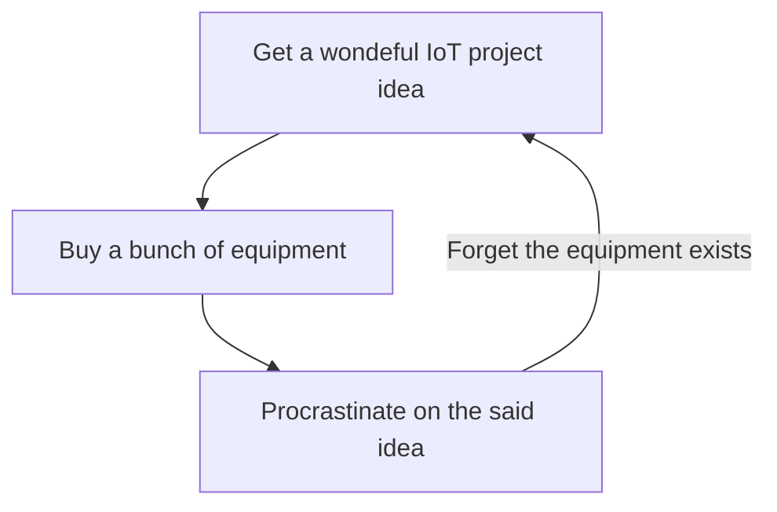

### Hi there 👋 Nice of you to visit!

Working mostly with work related Python and Kotlin projects for the past few years.

Always intersted in interesting OS projects related to geospatial field.

Battling often with...

<!--
**tommikarkas/tommikarkas** is a ✨ _special_ ✨ repository because its `README.md` (this file) appears on your GitHub profile.

Here are some ideas to get you started:

- 🔭 I’m currently working on ...
- 🌱 I’m currently learning ...
- 👯 I’m looking to collaborate on ...
- 🤔 I’m looking for help with ...
- 💬 Ask me about ...
- 📫 How to reach me: ...
- 😄 Pronouns: ...
- ⚡ Fun fact: ...
-->
